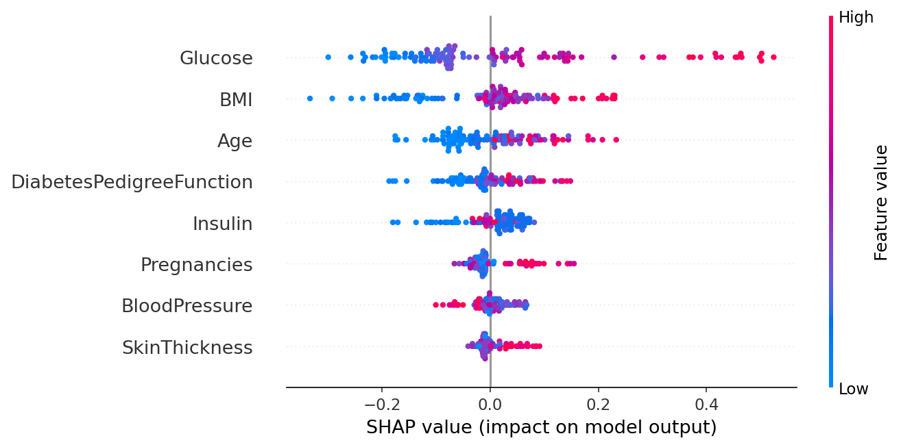

# Diabetes Risk Classifier — XGBoost + SHAP Explainability Dashboard

End-to-end ML pipeline that trains, calibrates, and serves an XGBoost classifier on the Pima Indians Diabetes dataset with per-prediction SHAP explanations.

---

## Architecture

```
Pima CSV
  └─► feature-engine (MeanMedianImputer, zero→NaN)
        └─► Optuna (50 trials, weighted F1)
              └─► XGBoost  ──┐
              └─► LightGBM ──┤─► Evaluation + SHAP
                              └─► CalibratedClassifierCV
                                    └─► FastAPI /predict  (SHAP per request)
                                    └─► Streamlit dashboard
                                    └─► Gradio demo
```

---

## Benchmarks

| Model | Accuracy | Weighted F1 | ROC-AUC | Brier Score |
|---|---|---|---|---|
| XGBoost | 0.7845 | 0.7862 | 0.8553 | 0.1481 |
| LightGBM | 0.7931 | 0.7942 | 0.8329 | 0.1653 |
| Calibrated XGBoost | 0.7845 | 0.7851 | 0.8375 | 0.1573 |

Top SHAP features: **Glucose**, **BMI**, **Age**, **DiabetesPedigreeFunction**, **Insulin**

---

## SHAP Beeswarm



---

## Stack

| Layer | Technology |
|---|---|
| Language | Python 3.12 |
| Gradient Boosting | XGBoost, LightGBM |
| Explainability | SHAP (PermutationExplainer) |
| HPO | Optuna (50 trials) |
| Feature Engineering | feature-engine |
| Calibration | sklearn CalibratedClassifierCV |
| Serving | FastAPI + Prometheus |
| Dashboard | Streamlit + Plotly |
| Demo | Gradio |
| Experiment Tracking | MLflow |
| Containerisation | Docker |

---

## Quick Start

```bash
# Install
python -m venv venv && source venv/bin/activate
pip install -r requirements.txt

# Run full pipeline
make train          # Optuna HPO + XGBoost/LightGBM training
make shap           # SHAP analysis + calibration
make evaluate       # Evaluation metrics

# Serve
make api            # FastAPI on :8000
make streamlit      # Streamlit dashboard on :8501
make gradio         # Gradio demo on :7860

# Docker
docker build -t b2-xgboost-shap .
docker run -p 8000:8000 b2-xgboost-shap
```

---

## API Endpoints

| Method | Path | Description |
|---|---|---|
| GET | `/api/v1/health` | Service health, uptime, memory |
| POST | `/api/v1/predict` | Single-patient prediction + SHAP values |
| GET | `/api/v1/model_info` | Model metadata + evaluation results |
| GET | `/metrics` | Prometheus metrics |

### Example

```bash
curl -X POST http://localhost:8000/api/v1/predict \
  -H "Content-Type: application/json" \
  -d '{"Pregnancies":2,"Glucose":120,"BloodPressure":70,
       "SkinThickness":20,"Insulin":80,"BMI":25.5,
       "DiabetesPedigreeFunction":0.3,"Age":28}'
```

Response:
```json
{
  "prediction": 0,
  "probability": 0.23,
  "label": "Non-Diabetic",
  "shap_values": {
    "Glucose": 0.031, "BMI": 0.018, "Age": -0.012, ...
  },
  "trace_id": "3fa85f64-5717-4562-b3fc-2c963f66afa6"
}
```

---

## CI Gates

All 8 gates must pass locally before every push:

```
black + isort → flake8 → mypy → bandit → radon → interrogate → pytest (70%+ cov) → pip-audit
```

---

## References

- Chen, T. & Guestrin, C. (2016). *XGBoost: A Scalable Tree Boosting System*. KDD.
- Lundberg, S. & Lee, S.-I. (2017). *A Unified Approach to Interpreting Model Predictions*. NeurIPS.
- Ke, G. et al. (2017). *LightGBM: A Highly Efficient Gradient Boosting Decision Tree*. NeurIPS.

---

## Topics

`xgboost` `shap` `explainability` `optuna` `mlops` `streamlit` `fastapi` `python` `mlflow` `lightgbm` `feature-engineering` `medical-ai`
